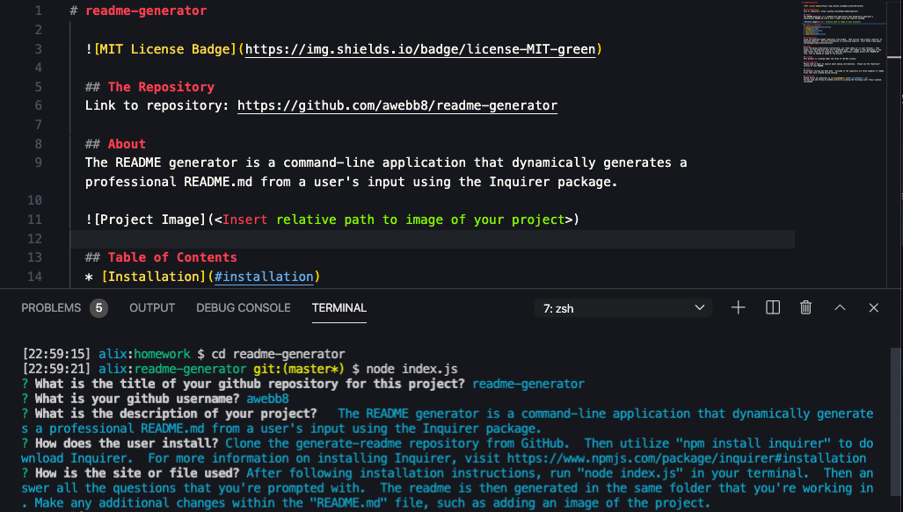

# readme-generator

  

  ## The Repository
  Link to repository: https://github.com/awebb8/readme-generator

  ## About
  The README generator is a command-line application that dynamically generates a professional README.md from a user's input using the Inquirer package. 

  

  ## Table of Contents
  * [Installation](#installation)
  * [Usage](#usage)
  * [License](#License)
  * [Tests](#Tests)
  * [Questions](#Questions)

  ## Installation
  Clone the generate-readme repository from GitHub.  Then utilize "npm install inquirer" to download Inquirer.  For more information on installing Inquirer, visit https://www.npmjs.com/package/inquirer#installation

  ## Usage
  After following installation instructions, run "node index.js" in your terminal.  Then answer all the questions that you're prompted with.  The readme is then generated in the same folder that you're working in. Make any additional changes within the "README.md" file, such as adding an image of the project.

  ## License
  This project is licensed under the terms of the MIT License.

  ## Contributing
  Please send an email to inquire about making contributions.  Please see the "Questions" section of this README.

  ## Tests
  In-terminal testing has been done.  Included in the repository are three examples of readme files that were created during testing.

  ## Questions
  Please direct all questions to [alixkwebb@gmail.com](alixkwebb@gmail.com)
  You may view and follow my GitHub profile by clicking the following link: https://github.com/awebb8
