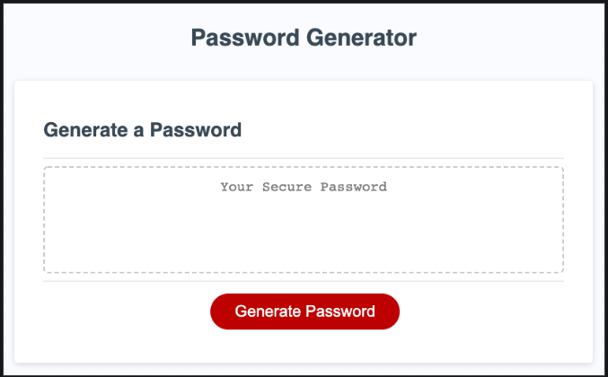

# password-generator

  

  ## The Repository
  Link to repository: https://github.com/awebb8/password-generator
  Link to deployed site: https://awebb8.github.io/password-generator/

  ## About
  The Password Generator application allows a user to randomly generate a password.  A user can create a password by choosing which type of characters to include in their password (uppercase letters, lowercase letters, numbers and/or special characters). The user must select at least one character type.

  

  ## Table of Contents
  * [Installation](#installation)
  * [Usage](#usage)
  * [License](#License)
  * [Tests](#Tests)
  * [Questions](#Questions)

  ## Installation
  Clone the repository using the link above to the GitHub repository

  ## Usage
  View the HTML page in the browser or click on the link above to the deployed site. Click the "Generate Password" button to generate a password.

  ## License
  This project is licensed under the terms of the MIT License.

  ## Contributing
  Please send an email to inquire about making contributions.  Please see the "Questions" section of this README.

  ## Tests
  In-browser testing has been completed to successfully generate multiple random passwords.

  ## Questions
  Please direct all questions to [alixkwebb@gmail.com](alixkwebb@gmail.com)
  You may view and follow my GitHub profile by clicking the following link: https://github.com/awebb8
